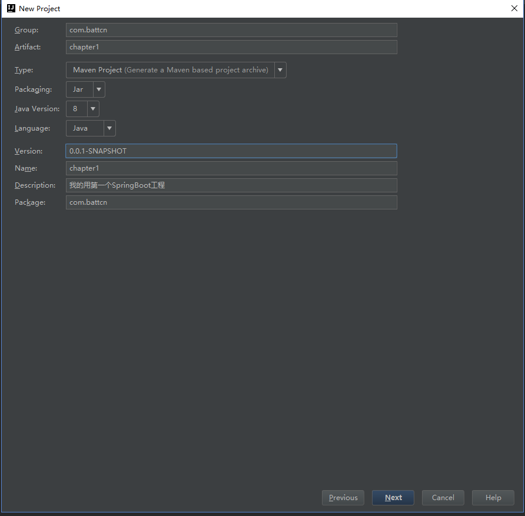
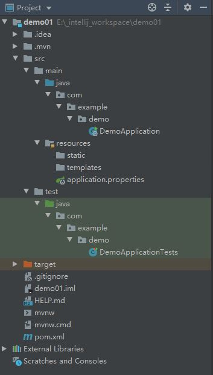

#### 选择**`Spring Initializr`**

#### 填写项目基本信息

- **`Group：`** 组织ID，一般分为多个段，这里我只说两段，第一段为域，第二段为公司名称。域又分为 `org、com、cn`等等，其中 **`org为非营利组织，com为商业组织`**。如阿里、淘宝（com.alibaba/com.taobao）

- **`Artifact:`** 唯一标识符，一般是项目名称

  

#### 选择包

**`Spring Initializr`** 为我们提供了很多的选项，不同的选项有不同的作用，在初期我们只需要依赖**`Web -> Web`** 就可以了，选择好依赖包之后点击**`Next` -> `Finish`**

#### 目录结构

```yml
- src
    -main
        -java
            -package
                #主函数，启动类，运行它如果运行了 Tomcat、Jetty、Undertow 等容器
                -SpringbootApplication	
        -resouces
            #存放静态资源 js/css/images 等
            - statics
            #存放 html 模板文件
            - templates
            #主要的配置文件，SpringBoot启动时候会自动加载application.yml/application.properties		
            - application.yml
    #测试文件存放目录		
    -test
 # pom.xml 文件是Maven构建的基础，里面包含了我们所依赖JAR和Plugin的信息
- pom
```



#### pom.xml依赖

因为使用了 **`Spring Initializr`** 插件，所以如下的配置都不需要我们自己去写啦，需要注意的是版本要选择 **`RELEASE`** ，稳定版本BUG少

#### 主函数入口

`DemoApplication`

```java
@RestController
@SpringBootApplication
public class DemoApplication {

    public static void main(String[] args) {
        SpringApplication.run(DemoApplication.class, args);
    }

    @GetMapping("/demo1")
    public String demo1(){
        return "Hello battcn";
    }

    @Bean
    public CommandLineRunner commandLineRunner(ApplicationContext ctx){
        return args -> {
            System.out.println("来看看SpringBoot默认为我们提供的Bean");
            String[] beanNames = ctx.getBeanDefinitionNames();
            Arrays.sort(beanNames);
            Arrays.stream(beanNames).forEach(System.out::println);
        };
    }

}
```

`@SpringBootApplication`

主函数类的标识注解

`@RestController`

此处演示，一般情况下应该新建controller类并加上该注解

RestController = ResponseBody + Controller

直接将结果返回成json格式

`commandLineRunner`

此方法可以查看SpringBoot加载的Bean

#### 修改默认配置

配置文件`application.properties`

```xml
# 默认的 8080 我们将它改成 9090 
server.port=9090
# 未定义上下文路径之前 地址是 http://localhost:8080 定义了后 http://localhost:9090 你能在tomcat做的事情，配置文件都可以
server.servlet.context-path=/chapter1
```

#### 测试

本次测试采用 **`junit`** 进行

```java
package com.example.demo;

import org.junit.Before;
import org.junit.Test;
import org.junit.runner.RunWith;
import org.springframework.beans.factory.annotation.Autowired;
import org.springframework.boot.test.context.SpringBootTest;
import org.springframework.boot.test.web.client.TestRestTemplate;
import org.springframework.boot.web.server.LocalServerPort;
import org.springframework.http.ResponseEntity;
import org.springframework.test.context.junit4.SpringRunner;

import java.net.URL;

import static org.junit.Assert.assertEquals;

@RunWith(SpringRunner.class)
@SpringBootTest(webEnvironment = SpringBootTest.WebEnvironment.RANDOM_PORT)
public class DemoApplicationTests {

    @LocalServerPort
    private int port;

    private URL base;

    @Autowired
    private TestRestTemplate template;

    @Before
    public void setUp() throws Exception{
        this.base = new URL("http://localhost:" + port + "/chapter1/demo1");
    }

    @Test
    public void contextLoads() {
        ResponseEntity<String> response = template.getForEntity(base.toString(), String.class);
        assertEquals(response.getBody(), "Hello battcn");
        System.out.println("--------------------------------------");
        System.out.println(port);
        System.out.println("--------------------------------------");

    }

}

```

- `@RunWith(SpringRunner.class)`

  使用junit时添加该注解，同时将**测试类**改为**public**，将**测试方法**改为**public**

- `@SpringBootTest(webEnvironment = SpringBootTest.WebEnvironment.RANDOM_PORT)`

  `@LocalServerPort`

  SpringBootTest是测试类必备注解，默认不含参数

  此处SpringBootTest内的参数与LocalServerPort注解搭配，为test随机分配端口号

- `assertEquals`

  需静态引入

  `import static org.junit.Assert.assertEquals;`

#### Mock测试

// TODO

