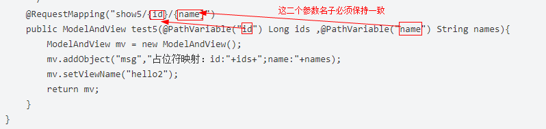
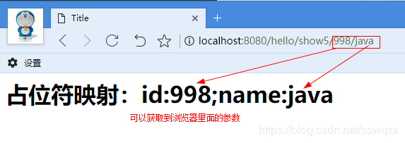

> #### JdbcTemplate特点

- 速度快，对比其它的ORM框架而言，JDBC的方式无异于是最快的
- 配置简单，`Spring`自家出品，几乎没有额外配置
- 学习成本低，毕竟`JDBC`是基础知识，`JdbcTemplate`更像是一个`DBUtils`

#### 导入依赖

在 `pom.xml` 中添加对 `JdbcTemplate` 的依赖

```xml
<!-- Spring JDBC 的依赖包，使用 spring-boot-starter-jdbc 或 spring-boot-starter-data-jpa 将会自动获得HikariCP依赖 -->
<dependency>
    <groupId>org.springframework.boot</groupId>
    <artifactId>spring-boot-starter-jdbc</artifactId>
</dependency>

<!-- MYSQL包 -->
<dependency>
    <groupId>mysql</groupId>
    <artifactId>mysql-connector-java</artifactId>
    <version>5.1.44</version>
</dependency>

<!-- junit包 -->
<dependency>
    <groupId>junit</groupId>
    <artifactId>junit</artifactId>
    <scope>test</scope>
</dependency>
```

mysql选用5.1.44版本，可以解决很多版本错误（与mysql8.0的兼容问题）

#### 连接数据库

在`application.properties`中添加如下配置。

```xml
// ssm是本地数据库的名称
spring.datasource.url=jdbc:mysql://localhost:3306/ssm
spring.datasource.password=admin
spring.datasource.username=root
// 此行在原文中没有添加，但是不添加会报错，具体含义TODO
spring.datasource.driver-class-name = com.mysql.jdbc.Driver 
```

#### 具体编码

完成基本配置后，接下来进行具体的编码操作。**为了减少代码量，就不写`UserDao`、`UserService`之类的接口了，将直接在`Controller`中使用`JdbcTemplate`进行访问数据库操作，这点是不规范的，各位别学我…**

##### 表结构

创建一张 `t_user` 的表

```my
CREATE TABLE `t_user` (
  `id` int(8) NOT NULL AUTO_INCREMENT COMMENT '主键自增',
  `username` varchar(50) NOT NULL COMMENT '用户名',
  `password` varchar(50) NOT NULL COMMENT '密码',
  PRIMARY KEY (`id`)
) ENGINE=InnoDB DEFAULT CHARSET=utf8 COMMENT='用户表';
```

##### 实体类

```java
package com.example.demo.entity;

public class User {

    private Long id;
    private String username;
    private String password;

    public User() {
    }

    public User(String username, String password) {
        this.username = username;
        this.password = password;
    }

    public User(Long id, String username, String password) {
        this.id = id;
        this.username = username;
        this.password = password;
    }

    @Override
    public String toString() {
        return "User{" +
                "id=" + id +
                ", username='" + username + '\'' +
                ", password='" + password + '\'' +
                '}';
    }

    public Long getId() {
        return id;
    }

    public void setId(Long id) {
        this.id = id;
    }

    public String getUsername() {
        return username;
    }

    public void setUsername(String username) {
        this.username = username;
    }

    public String getPassword() {
        return password;
    }

    public void setPassword(String password) {
        this.password = password;
    }
}

```

##### restful 风格接口

```java
package com.example.demo.controller;


import com.example.demo.entity.User;
import org.springframework.beans.factory.annotation.Autowired;
import org.springframework.jdbc.core.BeanPropertyRowMapper;
import org.springframework.jdbc.core.JdbcTemplate;
import org.springframework.web.bind.annotation.*;

import java.util.List;

@RestController
@RequestMapping("/users")
public class SpringJdbcController {

    private final JdbcTemplate jdbcTemplate;

    @Autowired
    public SpringJdbcController(JdbcTemplate jdbcTemplate){
        this.jdbcTemplate = jdbcTemplate;
    }

    @GetMapping
    public List<User> queryUsers() {
        // 查询所有用户
        String sql = "select * from t_user";
        return jdbcTemplate.query(sql, new Object[]{}, new BeanPropertyRowMapper<>(User.class));
    }

    @GetMapping("/{id}")
    public User getUser(@PathVariable Long id) {
        // 根据主键ID查询
        String sql = "select * from t_user where id = ?";
        return jdbcTemplate.queryForObject(sql, new Object[]{id}, new BeanPropertyRowMapper<>(User.class));
    }

    @DeleteMapping("/{id}")
    public int delUser(@PathVariable Long id){
        // 根据主键ID删除用户信息
        String sql = "delete from t_user where id = ?";
        return jdbcTemplate.update(sql, id);
    }

    @PostMapping
    public int addUser(@RequestBody User user){
        // 添加用户
        String sql = "insert into t_user(username, password) values(?, ?)";
        return jdbcTemplate.update(sql, user.getUsername(), user.getPassword());
    }

    @PutMapping("/{id}")
    public int editUser(@PathVariable Long id, @RequestBody User user){
        // 根据主键ID修改用户信息
        String sql = "update t_user set username = ?, password = ? where id = ?";
        return jdbcTemplate.update(sql, user.getUsername(), user.getPassword(), id);
    }

}

```

- ```
  public <T> List<T> query(String sql, @Nullable Object[] args, RowMapper<T> rowMapper)
  ```

  - sql语句，eg：`"select * from t_user where id = ?"`
  - 查询参数，eg：`new Object[]{id}`
  - 使用 `new BeanPropertyRowMapper<>(User.class)` 创建RowMapper，传入接收类的class
  - 返回一个List

- ```
  public <T> T queryForObject(String sql, @Nullable Object[] args, RowMapper<T> rowMapper)
  ```

  - @PathVariable

    通过 @PathVariable 可以将URL中占位符参数{xxx}绑定到处理器类的方法形参中@PathVariable(“xxx“) 

    

    

  - 返回一个数据对象

- ```
  public int update(String sql, @Nullable Object... args)
  ```

  - @RequestBody  *// 将ajax（datas）发出的请求写入 User 对象中*

    将 HTTP 请求正文插入方法中，使用适合的 HttpMessageConverter 将请求体写入某个对象。

    作用：

    - 该注解用于读取Request请求的body部分数据，使用系统默认配置的HttpMessageConverter进行解析，然后把相应的数据绑定到要返回的对象上；
    - 再把HttpMessageConverter返回的对象数据绑定到 controller中方法的参数上。

    使用时机：

    -  GET、POST方式提时， 根据request header Content-Type的值来判断:

      application/x-www-form-urlencoded， 可选（即非必须，因为这种情况的数据@RequestParam, @ModelAttribute也可以处理，当然@RequestBody也能处理）；
      multipart/form-data, 不能处理（即使用@RequestBody不能处理这种格式的数据）；
      其他格式， 必须（其他格式包括application/json, application/xml等。这些格式的数据，必须使用@RequestBody来处理）；

    - PUT方式提交时， 根据request header Content-Type的值来判断:

      application/x-www-form-urlencoded， 必须；multipart/form-data, 不能处理；其他格式， 必须；

      说明：request的body部分的数据编码格式由header部分的Content-Type指定；

  - @ResponseBody

    @Responsebody 注解表示该方法的返回的结果直接写入 HTTP 响应正文（ResponseBody）中，一般在异步获取数据时使用，通常是在使用 @RequestMapping 后，返回值通常解析为跳转路径，加上 @Responsebody 后返回结果不会被解析为跳转路径，而是直接写入HTTP 响应正文中。
    作用：

    - 该注解用于将Controller的方法返回的对象，通过适当的HttpMessageConverter转换为指定格式后，写入到Response对象的body数据区。

    使用时机：

    - 返回的数据不是html标签的页面，而是其他某种格式的数据时（如json、xml等）使用；

  - RestController = ResponseBody + Controller

#### 测试

由于上面的接口是 restful 风格的接口，添加和修改无法通过浏览器完成，所以需要我们自己编写`junit`或者使用`postman`之类的工具。

创建单元测试`Chapter4ApplicationTests`，通过`TestRestTemplate`模拟**`GET`、`POST`、`PUT`、`DELETE`等请求操作**

```java
package com.example.demo;

import com.example.demo.entity.User;
import org.junit.Test;
import org.junit.runner.RunWith;
import org.slf4j.Logger;
import org.slf4j.LoggerFactory;
import org.springframework.beans.factory.annotation.Autowired;
import org.springframework.boot.test.context.SpringBootTest;
import org.springframework.boot.test.web.client.TestRestTemplate;
import org.springframework.boot.web.server.LocalServerPort;
import org.springframework.core.ParameterizedTypeReference;
import org.springframework.http.HttpMethod;
import org.springframework.http.ResponseEntity;
import org.springframework.test.context.junit4.SpringRunner;

import java.util.List;

@RunWith(SpringRunner.class)
@SpringBootTest(classes = DemoApplication.class, webEnvironment = SpringBootTest.WebEnvironment.RANDOM_PORT)
public class DemoApplicationTests {

    private static final Logger log = LoggerFactory.getLogger(DemoApplication.class);

    @Autowired
    private TestRestTemplate template;

    @LocalServerPort
    private int port;

    @Test
    public void contextLoads() throws Exception {
        // POST
        template.postForEntity("http://localhost:" + port + "/users", new User("user1", "pass1"), Integer.class);
        log.info("[添加用户成功]\n");

        // GET
        // TODO 如果是返回的集合,要用 exchange 而不是 getForEntity ，后者需要自己强转类型
        ResponseEntity<List<User>> response2 = template.exchange("http://localhost:" + port + "/users", HttpMethod.GET, null, new ParameterizedTypeReference<List<User>>() {});
        final List<User> body = response2.getBody();
        log.info("[查询所有] - [{}]\n", body);
        Long userId = body.get(0).getId();
        // GET
        ResponseEntity<User> response3 = template.getForEntity("http://localhost:" + port + "/users/{id}", User.class, userId);
        log.info("[主键查询] - [{}]\n", response3.getBody());
        // PUT
        template.put("http://localhost:" + port + "/users/{id}", new User("user11", "pass11"), userId);
        log.info("[修改用户成功]\n");
        // DELETE
        template.delete("http://localhost:" + port + "/users/{id}", userId);
        log.info("[删除用户成功]");

    }

}

```

- ```java
  public <T> ResponseEntity<T> postForEntity(String url, Object request, Class<T> responseType, Object... urlVariables)
  ```

  - ==POST==

  - responseType

    需要有返回值时，传入对应的类型；

    不需要返回值时，传入Integer.class、String.class 均可，无所谓...

    post一般不需要返回值

- ```java
  public <T> ResponseEntity<T> exchange(String url, HttpMethod method, HttpEntity<?> requestEntity, ParameterizedTypeReference<T> responseType, Object... urlVariables)
  ```

  - ==GET==
  - 如果是返回的集合,要用 exchange 而不是 getForEntity ，后者需要自己强转类型

  -  最后一个参数为`new ParameterizedTypeReference<List<User>>() {}`

    匿名对象做参数，注意不要忘记大括号

- ```java
   public <T> ResponseEntity<T> getForEntity(String url, Class<T> responseType, Object... urlVariables)
  ```

  - ==GET==
  - 返回值为ResponseEntity<T> response，可调用response.getBody()方法查看返回值

- ``` java
  public void put(String url, Object request, Object... urlVariables)--
  ```

  - ==PUT==

- ```java
  public void delete(String url, Object... urlVariables)
  ```

  - ==DELETE==

**POST与PUT的区别**

这俩个方法初看一下好像都是更新资源，但是有本质上的区别，那就是语义。在HTTP中，PUT被定义为幂等（idempotent）的方法，POST则不是，这是一个很重要的区别。

首先解释幂等，幂等是数学的一个用语，对于单个输入或者无输入的运算方法，如果每次都是同样的结果，则称其是幂等的。也就是说，如果一个网络重复执行多次，产生的效果是一样的，那就是幂等（idempotent）。

**POST**
用于提交请求，可以更新或者创建资源，是非幂等的，举个例子：
在用户注册功能上，每次提交都是创建一个用户账号，这个时候就用POST。
ESTful URL地址应为：/user/creation?user_name=&pwd=

**PUT**
用于向指定URL传送更新资源，是幂等的。
还是用户模块，比如修改用户密码，虽然提交的还是账户名跟用户密码这个俩个必填参数，但是每次提交都只是更新该用户密码,每次请求都只是覆盖原先的值。此时就该用PUT。
ESTful URL地址应为：/user/{user_id}/modify?pwd=**

**用PUT还是POST**
当需要以更新的形式来修改某一具体资源的时候，如何判断用PUT还是POST呢？
很简单，如果该==更新==对应的URI多次调用的结果一致，则**PUT**。如果每次==提交==相同的内容（==添加==），最终结果不一致的时候，用**POST**。


**Log的用法**

1. 引入

   ```java
   import org.slf4j.Logger;
   import org.slf4j.LoggerFactory;
   ```

2. 声明

   ```java
   private static final Logger log = LoggerFactory.getLogger(DemoApplication.class);
   ```

3. 调用

   ```java
   log.info();
   ```

作用看起来和sout差不多，应该是可以写进日志，现在暂时用不到...