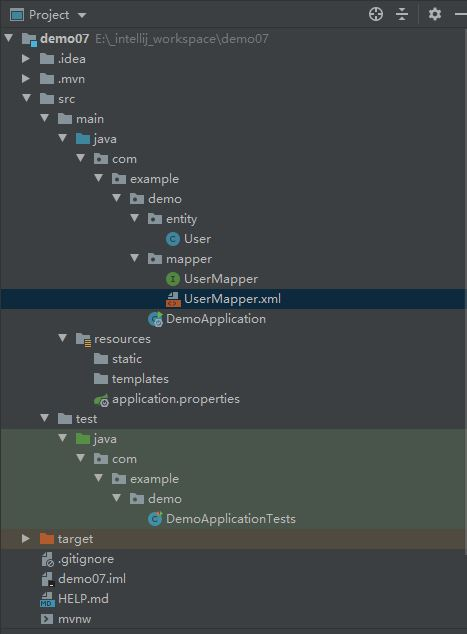

#### ORM对比图

以下针对**`Spring JDBC`、`Spring Data Jpa`、`Mybatis`**三款框架做了个粗略的对比。**一般应用的性能瓶颈并不是在于ORM，所以这三个框架技术选型应该考虑`项目的场景`、`团队的技能掌握情况`、`开发周期(开发效率)`…**

| 框架对比 | Spring JDBC | Spring Data Jpa | Mybatis |
| :------- | :---------- | :-------------- | :------ |
| 性能     | 性能最好    | 性能最差        | 居中    |
| 代码量   | 多          | 少              | 多      |
| 学习成本 | 低          | 高              | 居中    |
| 推荐指数 | ❤❤❤         | ❤❤❤❤❤           | ❤❤❤❤❤   |

### Mybayis

#### 文件结构



#### 导入依赖

添加 `Mybatis`、`mysql` 、`junit`的依赖包

```xml
        <dependency>
            <groupId>org.mybatis.spring.boot</groupId>
            <artifactId>mybatis-spring-boot-starter</artifactId>
            <version>1.3.2</version>
        </dependency>

        <!-- MYSQL包 -->
        <dependency>
            <groupId>mysql</groupId>
            <artifactId>mysql-connector-java</artifactId>
            <version>5.1.44</version>
        </dependency>

        <dependency>
            <groupId>junit</groupId>
            <artifactId>junit</artifactId>
            <scope>test</scope>
        </dependency>
```


#### 连接数据库

与**`SpringDataJpa`、`Spring JDBC`**一样，需要在`application.properties`中添加数据源的配置，同时也需要添加对`mybatis`的配置

```xml
spring.datasource.url=jdbc:mysql://localhost:3306/ssm
spring.datasource.password=admin
spring.datasource.username=root
// 原文中没有这一句，但是会报错
spring.datasource.driver-class-name=com.mysql.jdbc.Driver
# 注意注意
mybatis.mapper-locations=classpath:com/example/demo/mapper/*.xml
#mybatis.mapper-locations=classpath:mapper/*.xml        #这种方式需要自己在resources目录下创建mapper目录然后存放xml
mybatis.type-aliases-package=com.example.demo.entity
# 驼峰命名规范 如：数据库字段是  order_id 那么 实体字段就要写成 orderId
mybatis.configuration.map-underscore-to-camel-case=true
```

**`mybatis.configuration.map-underscore-to-camel-case`是一个非常好的配置项，合理的命名规范可以让我们省略很多不必要的麻烦，比如xx-mapper.xml中的`resultMap`的映射可以省略掉了**

**注意事项**

由于 **`mybatis.mapper-locations=classpath:com/battcn/mapper/\*.xml`**配置的在`java package`中，而`Spring Boot`默认只打入`java package -> *.java`，所以我们需要给`pom.xml`文件添加如下内容

```xml
<build>
    <resources>
        <resource>
            <directory>src/main/resources</directory>
        </resource>
        <resource>
            <directory>src/main/java</directory>
            <includes>
                <include>**/*.xml</include>
            </includes>
            <filtering>true</filtering>
        </resource>
    </resources>
    <plugins>
        <plugin>
            <groupId>org.springframework.boot</groupId>
            <artifactId>spring-boot-maven-plugin</artifactId>
        </plugin>
    </plugins>
</build>
```

==注意==

- 在配置mapper时，原作者将UserMapper.xml放在了package包中，如上所示，需要进行许多额外的配置；

- 但是在尝试了`mybatis.mapper-locations=classpath:mapper/*.xml`  （#这种方式需要自己在resources目录下创建mapper目录然后存放xml）后，仍然需要**注意事项**配置...


​		暂时不知道哪里出了问题，可能是在resources目录下自行创建的文件夹不会被Springboot扫描

- 将mapper文件夹放入static文件夹后，没有**注意事项**的配置也能成功运行


- 结论：上述猜测可能是正确的，待证实

#### 具体编码

##### 表结构

创建一张 `t_user` 的表

```mysql
CREATE TABLE `t_user` (
  `id` int(8) NOT NULL AUTO_INCREMENT COMMENT '主键自增',
  `username` varchar(50) NOT NULL COMMENT '用户名',
  `password` varchar(50) NOT NULL COMMENT '密码',
  PRIMARY KEY (`id`)
) ENGINE=InnoDB DEFAULT CHARSET=utf8 COMMENT='用户表';
```

##### 实体类

```java
package com.example.demo.entity;

import java.io.Serializable;

public class User implements Serializable {

    private static final long serialVersionUID = 8655851615465363473L;

    private Long id;
    private String username;
    private String password;

    public Long getId() {
        return id;
    }

    public void setId(Long id) {
        this.id = id;
    }

    public String getUsername() {
        return username;
    }

    public void setUsername(String username) {
        this.username = username;
    }

    public String getPassword() {
        return password;
    }

    public void setPassword(String password) {
        this.password = password;
    }

    public User() {
    }

    public User(String username, String password) {
        this.username = username;
        this.password = password;
    }

    public User(Long id, String username, String password) {
        this.id = id;
        this.username = username;
        this.password = password;
    }

    @Override
    public String toString() {
        return "User{" +
                "id=" + id +
                ", username='" + username + '\'' +
                ", password='" + password + '\'' +
                '}';
    }
}

```

此处实现Serializable接口意义不明，待补充

### 持久层

这里提供了两种方式操作接口，第一种带`@Select`注解的是`Mybatis3.x`提供的新特性，同理它还有**`@Update`、`@Delete`、`@Insert`等等一系列注解**，第二种就是传统方式了，写个接口映射，然后在XML中写上我们的SQL语句…

**UserMapper**

```java
package com.example.demo.mapper;

import com.example.demo.entity.User;
import org.apache.ibatis.annotations.Mapper;
import org.apache.ibatis.annotations.Param;
import org.apache.ibatis.annotations.Select;

import java.util.List;

/**
 * t_user 操作：演示两种方式
 * <p>第一种是基于mybatis3.x版本后提供的注解方式<p/>
 * <p>第二种是早期写法，将SQL写在 XML 中<p/>
 */
@Mapper
public interface UserMapper {

    /**
     * 根据用户名查询用户结果集
     *
     * @param username 用户名
     * @return 查询结果
     */
    @Select("SELECT * FROM t_user WHERE username = #{username}")
    List<User> findByUsername(@Param("username") String username);


    /**
     * 保存用户信息
     *
     * @param user 用户信息
     * @return 成功 1 失败 0
     */
    int insert(User user);
}
```

- @Mapper 与 @Select @Insert @Update @Delete等搭配使用，可以替代xml配置

- @Param 用于传递参数，从而可以与SQL中的的字段名相对应

  我们先来看Mapper接口中的@Select方法

  ```java
  package Mapper;
  public interface Mapper {
  @Select("select s_id id,s_name name,class_id classid from student where s_name= #{aaaa} and class_id = #{bbbb}")
    public Student select(@Param("aaaa") String name,@Param("bbbb")int class_id);
  @Delete......
  @Insert......
  } 
  ```

  这里解释一下

  1.@Select注解的作用就是告诉mybatis框架,执行括号内的sql语句

  2.`s_id id,s_name name,class_id classid ` 格式是 字段名+属性名,例如s_id是数据库中的字段名,id是类中的属性名

    这段代码的作用就是实现数据库字段名和实体类属性的一一映射,不然数据库不知道如何匹配

  3.`where s_name= #{aaaa} and class_id = #{bbbb} `表示sql语句要接受2个参数,一个参数名是aaaa,一个参数名是bbbb,如果要正确的传入参数,那么就要给参数命名,因为不用xml配置文件,那么我们就要用别的方式来给参数命名,这个方式就是@Param注解

  4.在方法参数的前面写上@Param("参数名"),表示给参数命名,名称就是括号中的内容

  ```java
  public Student select(@Param("aaaa") String name,@Param("bbbb")int class_id);
  ```

  给入参 String name 命名为aaaa,然后sql语句....where s_name= #{aaaa} 中就可以根据aaaa得到参数值了

  [@Param详解](https://blog.csdn.net/M_Jack/article/details/79569015)

`UserMapper` 映射文件

```xml
<?xml version="1.0" encoding="UTF-8" ?>
<!DOCTYPE mapper PUBLIC "-//mybatis.org//DTD Mapper 3.0//EN" "http://mybatis.org/dtd/mybatis-3-mapper.dtd" >
<mapper namespace="com.example.demo.mapper.UserMapper">

    <insert id="insert" parameterType="com.example.demo.entity.User">
    INSERT INTO `t_user`(`username`,`password`) VALUES (#{username},#{password})
  </insert>

</mapper>
```

xml配置文件里的参数暂时没有去详细理解，尽可能的先使用java注解配置

### 测试

完成数据访问层接口后，最后编写一个`junit`测试类来检验代码的正确性。

```java
package com.example.demo;

import com.example.demo.entity.User;
import com.example.demo.mapper.UserMapper;
import org.junit.Test;
import org.junit.runner.RunWith;
import org.slf4j.Logger;
import org.slf4j.LoggerFactory;
import org.springframework.beans.factory.annotation.Autowired;
import org.springframework.boot.test.context.SpringBootTest;
import org.springframework.test.context.junit4.SpringRunner;

import java.util.List;


@RunWith(SpringRunner.class)
@SpringBootTest
public class DemoApplicationTests {

    private static final Logger log = LoggerFactory.getLogger(DemoApplicationTests.class);

    // 此处会报错，但是无所谓
    @Autowired
    private UserMapper userMapper;

    @Test
    public void test1() throws Exception {
        final int row1 = userMapper.insert(new User("u1", "p1"));
        log.info("[添加结果] - [{}]", row1);
        final int row2 = userMapper.insert(new User("u2", "p2"));
        log.info("[添加结果] - [{}]", row2);
        final int row3 = userMapper.insert(new User("u1", "p3"));
        log.info("[添加结果] - [{}]", row3);
        final List<User> u1 = userMapper.findByUsername("u1");
        log.info("[根据用户名查询] - [{}]", u1);
    }
}

```

直接调用接口的方法即可


#### idea中Mybatis的mapper接口使用@Autowired引入报错

猜测：idea BUG

[具体链接](https://blog.csdn.net/myushu/article/details/79548442)

直接使用是可以执行的，如果看着不爽，就在mapper类上添加@Repository