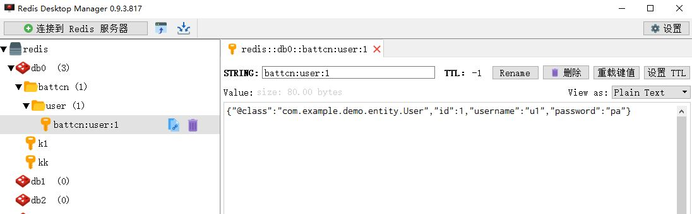

#### **前言**

Spring Boot 除了支持常见的ORM框架外，更是对常用的中间件提供了非常好封装，随着Spring Boot2.x的到来，支持的组件越来越丰富，也越来越成熟，其中对Redis的支持不仅仅是丰富了它的API，更是替换掉底层Jedis的依赖，取而代之换成了Lettuce(生菜)

#### Redis介绍

Redis是一个开源的使用ANSI C语言编写、支持网络、可基于内存亦可持久化的日志型、Key-Value数据库，并提供多种语言的API。相比`Memcached`它支持存储的类型相对更多**（`字符`、`哈希`、`集合`、`有序集合`、`列表`、`GEO`）**，**同时`Redis`是线程安全的**。2010年3月15日起，Redis的开发工作由VMware主持，2013年5月开始，Redis的开发由`Pivotal`赞助。

#### Lettuce

`Lettuce` 和 `Jedis` 的都是连接`Redis Server`的客户端程序。`Jedis`在**实现上是直连`redis server`，多线程环境下非线程安全，除非使用连接池，为每个Jedis实例增加物理连接**。`Lettuce`基于Netty的连接实例（StatefulRedisConnection），**可以在多个线程间并发访问，且线程安全，满足多线程环境下的并发访问，同时它是可伸缩的设计，一个连接实例不够的情况也可以按需增加连接实例**。

#### 导入依赖

在 `pom.xml` 中`spring-boot-starter-data-redis`的依赖，`Spring Boot2.x` 后底层不在是`Jedis`如果做版本升级的朋友需要注意下

```xml
<dependency>
    <groupId>org.springframework.boot</groupId>
    <artifactId>spring-boot-starter-data-redis</artifactId>
</dependency>

<dependency>
    <groupId>org.apache.commons</groupId>
    <artifactId>commons-pool2</artifactId>
</dependency>

<dependency>
    <groupId>junit</groupId>
    <artifactId>junit</artifactId>
    <scope>test</scope>
</dependency>
```

#### 属性配置

在 `application.properties` 文件中配置如下内容，由于`Spring Boot2.x` 的改动，连接池相关配置需要通过`spring.redis.lettuce.pool` 或者 `spring.redis.jedis.pool` 进行配置了

```properties
spring.redis.host=localhost
# 此处我本地的redis没有设置密码，则设置为空
spring.redis.password=
# 连接超时时间（毫秒）
spring.redis.timeout=10000
# Redis默认情况下有16个分片，这里配置具体使用的分片，默认是0
spring.redis.database=0
# 连接池最大连接数（使用负值表示没有限制） 默认 8
spring.redis.lettuce.pool.max-active=8
# 连接池最大阻塞等待时间（使用负值表示没有限制） 默认 -1
spring.redis.lettuce.pool.max-wait=-1
# 连接池中的最大空闲连接 默认 8
spring.redis.lettuce.pool.max-idle=8
# 连接池中的最小空闲连接 默认 0
spring.redis.lettuce.pool.min-idle=0
```

#### 具体编码

`Spring Boot`对`Redis`的支持已经非常完善了，良好的序列化以及丰富的API足够应对日常开发

##### 实体类

```java
package com.example.demo.entity;

import java.io.Serializable;

public class User implements Serializable {

    private static final long serialVersionUID = 8655851615465363473L;
    private Long id;
    private String username;
    private String password;

    public Long getId() {
        return id;
    }

    public void setId(Long id) {
        this.id = id;
    }

    public String getUsername() {
        return username;
    }

    public void setUsername(String username) {
        this.username = username;
    }

    public String getPassword() {
        return password;
    }

    public void setPassword(String password) {
        this.password = password;
    }

    public User() {

    }

    public User(String username, String password) {
        this.username = username;
        this.password = password;
    }

    public User(Long id, String username, String password) {
        this.id = id;
        this.username = username;
        this.password = password;
    }

    @Override
    public String toString() {
        return "User{" +
                "id=" + id +
                ", username='" + username + '\'' +
                ", password='" + password + '\'' +
                '}';
    }
}

```

##### 自定义Template

默认情况下的模板只能支持`RedisTemplate<String, String>`，也就是只能存入字符串，这在开发中是不友好的，所以自定义模板是很有必要的，当自定义了模板又想使用`String`存储这时候就可以使用`StringRedisTemplate`的方式，它们并不冲突…

```java
package com.example.demo.config;

import org.springframework.boot.autoconfigure.AutoConfigureAfter;
import org.springframework.boot.autoconfigure.data.redis.RedisAutoConfiguration;
import org.springframework.context.annotation.Bean;
import org.springframework.context.annotation.Configuration;
import org.springframework.data.redis.connection.lettuce.LettuceConnectionFactory;
import org.springframework.data.redis.core.RedisTemplate;
import org.springframework.data.redis.serializer.GenericJackson2JsonRedisSerializer;
import org.springframework.data.redis.serializer.StringRedisSerializer;

import java.io.Serializable;

@Configuration
@AutoConfigureAfter(RedisAutoConfiguration.class)
public class RedisCacheAutoConfiguration {

    @Bean
    public RedisTemplate<String, Serializable> redisCacheTemplate(LettuceConnectionFactory redisConnectionFactory) {
        RedisTemplate<String, Serializable> template = new RedisTemplate<>();
        template.setKeySerializer(new StringRedisSerializer());
        template.setValueSerializer(new GenericJackson2JsonRedisSerializer());
        template.setConnectionFactory(redisConnectionFactory);
        return template;
    }
}
```

**注意：**

- 自定义了返回值为`RedisTemplate<String, Serializable>`的方法
- @Configuration将该类注册为配置类，在spring boot中会被自动扫描
- @AutoConfigureAfter在加载配置的类之后再加载当前类，此处需先加载`RedisAutoConfiguration.class`
- 传参`LettuceConnectionFactory redisConnectionFactory`，作用不是很懂，StringRedisTemplate源码中传参是`RedisConnectionFactory connectionFactory`，很相似，也是不知道作用，暂时先模仿吧...

##### 测试

完成准备事项后，编写一个`junit`测试类来检验代码的正确性，有很多人质疑过`Redis`线程安全性，故下面也提供了响应的测试案例，如有疑问欢迎指正

```java
package com.example.demo;

import com.example.demo.entity.User;
import org.junit.Test;
import org.junit.runner.RunWith;
import org.slf4j.Logger;
import org.slf4j.LoggerFactory;
import org.springframework.beans.factory.annotation.Autowired;
import org.springframework.boot.test.context.SpringBootTest;
import org.springframework.data.redis.core.RedisTemplate;
import org.springframework.data.redis.core.StringRedisTemplate;
import org.springframework.test.context.junit4.SpringRunner;

import java.io.Serializable;
import java.util.concurrent.ExecutorService;
import java.util.concurrent.Executors;
import java.util.stream.IntStream;

@RunWith(SpringRunner.class)
@SpringBootTest
public class DemoApplicationTests {

    private static final Logger log = LoggerFactory.getLogger(DemoApplicationTests.class);

    @Autowired
    private StringRedisTemplate stringRedisTemplate;

    @Autowired
    private RedisTemplate<String, Serializable> redisCacheTemplate;


    @Test
    public void get() {
        // TODO 测试线程安全
        ExecutorService executorService = Executors.newFixedThreadPool(1000);
        IntStream.range(0, 1000).forEach(i ->
                executorService.execute(() -> stringRedisTemplate.opsForValue().increment("kk", 1))
        );
        stringRedisTemplate.opsForValue().set("k1", "v1");
        final String k1 = stringRedisTemplate.opsForValue().get("k1");
        log.info("[字符缓存结果] - [{}]", k1);
        // TODO 以下只演示整合，具体Redis命令可以参考官方文档，Spring Data Redis 只是改了个名字而已，Redis支持的命令它都支持
        // 下面语句创建了一个文件夹的形式
        String key = "battcn:user:1";
        redisCacheTemplate.opsForValue().set(key, new User(1L, "u1", "pa"));
        // TODO 对应 String（字符串）
        final User user = (User) redisCacheTemplate.opsForValue().get(key);
        log.info("[对象缓存结果] - [{}]", user);
    }

}

```

- ExecutorService 线程池知识 // TODO

- 结果如下：

  

##### 其它类型

下列的就是`Redis`其它类型所对应的操作方式

- **opsForValue：** 对应 String（字符串）
- **opsForZSet：** 对应 ZSet（有序集合）
- **opsForHash：** 对应 Hash（哈希）
- **opsForList：** 对应 List（列表）
- **opsForSet：** 对应 Set（集合）
- **opsForGeo：** 对应 GEO（地理位置）